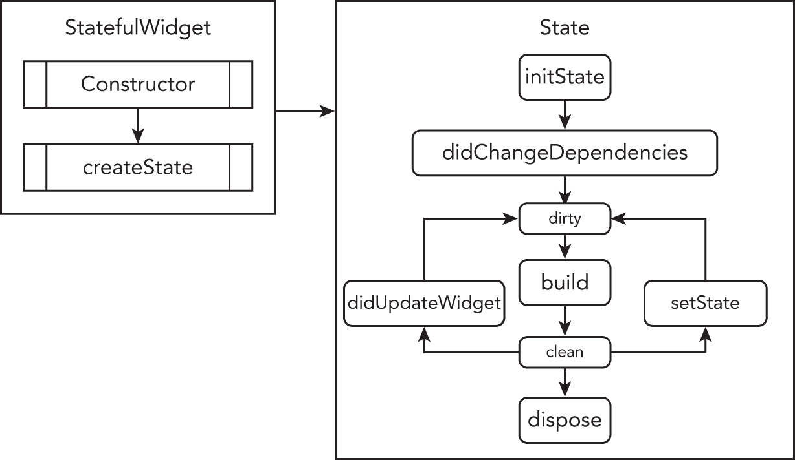
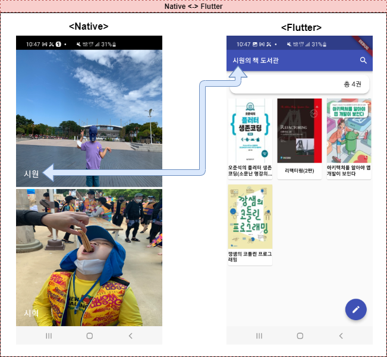

#  Flutter

Flutter는 단일 코드베이스에서 iOS, Android, Linux, Mac, Windows, Google Fuchsia 및 웹용 애플리케이션을 개발하는 데 사용되는 Google에서 만든 오픈 소스 UI 소프트웨어 개발 도구 키트이다.

Flutter는 Dart 프로그래밍 언어로 작성되어 크로스 플랫폼 소프트웨어 개발을 위한 이상적인 프레임워크이다.


## 1. Flutter Achitecture Layer

- Flutter는 확장 가능한 계층화된 시스템으로 설계되었다. 

- 3개의 레이어에 각각 의존하는 독립 라이브러리로 존재하며 어떤 계층도 아래 계층에 대한 액세스 권한이 없는 것이 특징이다.

  
  
  


#### 1.1. Embedder Layer

- 입력 및 UI Rendering 등의 서비스에 액세스를 하기위한 역할을 담당하며 OS 플랫폼 별 로 존재한다.

- Android용 Java 및 C++, iOS 및 macOS용 Objective-C/Objective-C++, Windows 및 Linux용 C++와 같은 해당 플랫폼별 언어로 작성된다.

- Flutter 코드는 기존 애플리케이션에 Module 과 Embedder를 사용하여 전체 애플리케이션의 콘텐츠로 포함할 수 있다.

  즉, 기존 Project 위에 일부 Flutter 코드로 추가가 가능하다.

  

#### 1.2. Engine Layer

- C/C++로 작성되어 있으며 Rendering 을 통해 화면을 그리니 역할을 담당한다.

-  Dart 클래스의 주요 C++ 코드를 래핑하고 텍스트 레이아웃, 파일 및 네트워크 I/O, 플러그인 아키텍처, Dart 런타임 및 컴파일 도구 체인 을 포함한 Flutter의 핵심 API의 저수준 구현을 제공한다.

 

#### 1.3. Framework Layer

- Framework  Layer는 개발자가 Flutter와 상호 작용할 수 있는 부분이다.

- Flutter 프레임워크는 Dart언어로 작성된 반응적이고 다양한 프레임워크를 제공한다.

- Framework 계층 내에서 주요 구성요소는 다음과 같으며 코드를 작성 하는데 필요한 Animation, Draw, Gesture 와 같은 기본 클래스도 제공 된다.
  #### - Rendering
  #### - Widgets
  #### - Material / cupertino
  


## 2. FlutterView의 구조

- 프로젝트를 신규로 제작하면 Android 의 경우 FlutterAcitivity 를 상속받은 Empty activity 하나가 생기며 프로그래밍 시에는 Activity 내에 아무런 코드를 작성하지 않아도 동작한다.

- 아래 Flutter 뷰 구조를 보면 FlutterAcitivity 는 하나의 FlutterView 를 가지고 있다. 

  해당 뷰에서 FlutterEngine 을 통해 Texture 방식의 Rendering 이 이루어 지며 Dart 언어를 해석 하고 JNI 와 연동하여 실행하게 된다.

- Flutter 내부 코드를 확인해본 바로는 FlutterEngine에서  Asset 에 있는 Dart 코드를 해석하여 TextureView 에 Rendering 을 하고 있는 것으로 확인된다.

- Skia 엔진을 통해 Rendering 을 하는 것이 특징이기 때문에 UI 성능이 좋으며 60fps 의 속도로 화면을 갱신함에 있어 무리가 없다.

                             


- FlutterView와 Native 의 기능 연동을 위해 Channel 이라는 것이 제공 되는데 웹뷰와 Native 연동을 위한 Web To App 기법과 유사하다.
- FlutterEngine 내부에는 OS Platform 과 연동할 수 있는 SystemChannel 들이 포함되어 있다.
```dart
[text_input.dart]
static void finishAutofillContext({ bool shouldSave = true }) {
    assert(shouldSave != null);
    TextInput._instance._channel.invokeMethod<void>(
    'TextInput.finishAutofillContext',  // Channel 명령어
    shouldSave,
);
```
```java
[TextInputChannel.java]
final MethodChannel.MethodCallHandler parsingMethodHandler = new MethodChannel.MethodCallHandler() {

   @Override
    public void onMethodCall(@NonNull MethodCall call, @NonNull MethodChannel.Result result) {
      String method = call.method;
      Object args = call.arguments;
                
      switch (method) {
	    case "TextInput.finishAutofillContext": // Channel 명령어
            textInputMethodHandler.finishAutofillContext((boolean) args);
            result.success(null);
            break;
      }
   }
}
```


## 3. Flutter Component

- Flutter 를 구성하고 있는 주요 Widget Class 및 Navigator 에 대해 설명한다.


#### 3.1. Widget
- flutter 에서 View 를 구성하는 것은 모두 Widget 으로 구성된다.

- Image, Icon, Text 같은 Show Component 와 Row, Column, Padding 과 같은 위치 Component 모두  Widget 이다.

- 해당 Show Component 들은 단독으로 쓰이기 보다는 위치 Comonent 와 함께 작성되어야 한다.

  

#### 3.2. Rendering

- Flutter 는 Widget 으로 만들어진 Layer Tree 를 **Skia** 라는 그래픽 라이브러리를 이용하여 화면을 만들어낸다.

- Skia 는 Android, iOS, Chrome 등 다양한 환경 에서 공통 API를 가지고 화면을 그릴수 있도록 도와주는 오픈 소스 2D 그래픽 라이브러리이며 만들어낸 View Data 를 가지고 각 디바이스 들은 CPU 와 GPU 를 이용해, 화면에 그려낸다

- 각각의 디바이스 ( iOS 나 Android ) 들의 Native Component 를 사용하지 않기 때문에, 동일한 스타일의 화면을 만들어 낼 수 있다.

  

#### 3.3. StatelessWidget 과 StatefulWidget
- Flutter 에서 Widget 은 StatelessWidget 과 StatefulWidget 를 상속 받아 만들어 진다.-

- 위 Widget 들은 Build 메서드를 포함하며, 이 Build 메서드를 이용해서 Layer Tree 가 생성된다.

- StatelessWidget 은 단 한번 만 Build 과정이 일어나며 성능 상 장점이 생긴다.

- StatefulWidget 은 state(상태) 를 포함하며, setState 가 발생할때마다 다시 Build 과정이 일어난다. 때문에, 동적 화면을 쉽게 구현이 가능하지만 복잡한 구조의 View 인 경우 성능에 문제가 발생 할 수 있다.

  

#### 3.4. UI Design Theme

- UI Theme 로 크게 [Google Android](https://flutter.dev/docs/development/ui/widgets/material)의 Material Widget  과[Apple iOS](https://flutter.dev/docs/development/ui/widgets/cupertino)의 Cupertino Widget 을 제공한다.
- 각 OS 별로 버튼 디자인이 달라야 할 경우 Theme 를 이용하여 각 디바이스에 따라 스타일을 설정할 수 있다.


#### 3.5. Navigation Router

- Flutter 에서 화면 이동 시에 대한 순서 정보를 Navigator Widget 으로 Route 객체의 스택을 관리한다.
- Native App 과 비슷하게 Navigator.push 및 Navigator.pop 으로 Route 스택 관리하며 직접 구현도 가능하다.
- push 대신 pushName 도 대체 가능하며 처음 위치인 initialRoute과 각 페이지들을 routes 를 설정 후, Navigator.pushNamed 로 routes 에서 설정한 path 를 전달하여, 페이지를 전환할 수 있다.

```Dart
class MyApp extends StatelessWidget {
  @override
  Widget build(BuildContext context) {
    return MaterialApp(
      title: 'Navigator Name Stack',
      initialRoute: '/',
      routes: {
        '/': (context) => FirstScreen(),
        '/second': (context) => SecondScreen(),
      },
    );
  }
}

class FirstScreen extends StatelessWidget {
  @override
  Widget build(BuildContext context) {
    return Scaffold(
      appBar: AppBar(
        title: Text('First Screen'),
      ),
      body: Center(
        child: RaisedButton(
          child: Text('Second screen'),
          onPressed: () {
            Navigator.pushNamed(context, '/second');
          },
        ),
      ),
    );
  }
}
```


#### 3.6. 비동기 처리 Future / async / await

#####   3.6.1. Future

- 비동기 작업의 결과를 나타내며 미완료(value를 생성하기 전)와 완료(value 생성)의 두 가지 상태를 가지며 성공과 error 두가지 의 결과 값을 얻을 수 있다.

  

 ##### 3.6.2 async

- 비동기를 실행하겠다는 의미의 명령어.

  


##### 3.6.3 await

- 비동기 진행 시 결과를 대기하겠다는 의미의 명령어.

  

```Dart
void main() {
  print('start async');

  asynMethod();

  print('end async');
}

asyncMethod() async {
  Future<String> fileName = await getName();
  print(fileContent);
}

Future<String> getName() {
  Future<String> result = Future.delayed(Duration(seconds: 5), () {
    return 'My name is yabigom';
  });

  return result;
}


# 결과
- start async
- end async  
- My name is yabigom
```


### 3.7. Stateful Widget Lifecycle
- Flutter에서는 단순히 화면을 구성하는 Stateless Widget 과는 달리 Stateful 위젯은 항상 변화하는 상태의 Widget 이기 때문에 Lifecycle 를 가지고 있다.

- 아래의 그림은 StatueFulWidget 의 생성부터 종료 되기 까지의 Lifecycle 의 흐름에 대해 설명한다.

  

  


#### 3.7.1. createState()

- 신규 Stateful Widget을 생성할 때 호출된다.
- Widget tree 에 state를 생성한다.


#### 3.7.1. initState()

- 위젯이 생성될때 최초 1회만 호출된다.

- 반드시 super.initState()를 호출해야하며 이곳에서 데이터 초기화 등을 진행한다.

  

#### 3.7.2. didChangeDependencies()
- initState() 다음에 호출 되며 데이터에 의존하는 위젯 객체가 호출될때마다 호출된다.

  

#### 3.7.3. build()
- StatefulWidget 에 변화가 생길 때 주기적으로 호출된다.
- 화면이 그려지는 렌더링 개념이 강하며 60fps의 속도로 갱신한다.
- 반드시 Widget을 리턴해야한다.


#### 3.7.4. didUpdateWidget()

- 상위 위젯이 변경되어 하위 위젯을 재 구성이 필요한 경우 호출된다.

- 이곳에서 데이터 등을 초기화 할 수 있다.

  

#### 3.7.5. setState()

- 데이터가 변경되었음을 Framework 에 알려주는 함수로  UI를 갱신 할 수 있도록 한다.

- 개발자로부터 자주 호출되며 Android의 NotifyChanged() 와 유사하다.

  

#### 3.7.6. deactivate()

- WidgetTree 에서 State 객체가 제거 될 때 호출 된다.
- State 객체가 메모리에서 완전히 지워진건 아니기 때문에 dispose() 전까지 State 객체를 사용 할 수 있다.


#### 3.7.7. dispose()

- Widget 객체가 영구적으로 제거 될 때 호출 된다.

  


## 4. Flutter 응용 어플리케이션 구현

- Flutter의 기술들을 응용하여 도서관리 Application (MyBooks) 을 개발 진행하였으며 Flutter Framework 에서 제공하는 

  Component / Database / Network 모듈의 활용과 외부 Lib 연동에 집중하는 등 다양한 개발 가능성에 대해 시도하였다.

- 주요 기능으로는 Database를 이용한 사용자 별 도서 등록 / 조회 / 수정/ 삭제 기능이 있으며 부가 기능으로는 바코드 스캔과 Kakao 도서 API 연동 등이 구현되었다.

  

#### 4.1. Native 와 Flutter 의 연동

- Android 애플리케이션의 일부로 FlutterActivity 포함 가능성 여부를 확인 하기 위해 첫번째 화면을 Native 로 구현하였으며 두번째 flutter  화면에서 사용자 정보를 Native 와 연동하는 방식으로 구현하였다.

        


- Native 에서 FlutterActivity 호출 시 인자를 넘길 방법이 마땅치 않아 Flutter 화면에서 Native 의 정보를 가져갈 수 있도록 CustomChannel을 생성하여 Native에서 User 정보를 가져갈 수 있도록 구현하였다.


```Java
# Native 채널 설정
private static final String CHANNEL = "com.yabigom.book.book/userInfo"; // 채널정보

public class MainActivity extends FlutterActivity {
    
    @Override
    public void configureFlutterEngine(FlutterEngine flutterEngine) {
        GeneratedPluginRegistrant.registerWith(flutterEngine);
        final MethodChannel channel = new MethodChannel(flutterEngine.getDartExecutor(), CHANNEL);
        channel.setMethodCallHandler(handler);
    }

    private MethodChannel.MethodCallHandler handler = (methodCall, result) -> {
        if (methodCall.method.equals("getUserInfo")) {  // 채널 메소드 정보
            result.success(getUserName());
        } else {
            result.notImplemented();
        }
    };

    private String getUserName() {
        Log.i("yabigom", "getUserName() : " + userName);
        return userName;
    }
}


# FLutter 에서 Native 정보 요청
class BookListState extends State<BookListApp> {

  static const platform = const MethodChannel(CHANNEL);

  Future<void> getUserInfo() async {
      try {
        final String result = await platform.invokeMethod('getUserInfo');
        userName = result;
      } on PlatformException catch (e) {
        userName = 'Unknown';
      }
    }
}
```


#### 4.2. SingleTon 형태의 DB Manager 구성

- DB Connection의 인스턴스를 하나만 생성하기 위해 SingleTon 으로 구성하였다.

```Dart
// Database Manager (Singleton)
class DatabaseManager {
  static final DatabaseManager _instance = DatabaseManager._internal();
  factory DatabaseManager() => _instance;

  static const String table_booklist = "BookList";
  late Future<Database> db;

  DatabaseManager._internal() {
    db = initDatabase();
  }

  // Database 생성
  Future<Database> initDatabase() async {
    return openDatabase(
      join(await getDatabasesPath(), 'book_database.db'),
        onCreate: (db, version) {
          return db.execute(
            "Create TABLE BookList(id INTEGER PRIMARY KEY AUTOINCREMENT, "
               "thumbnail TEXT, title TEXT, publisher TEXT, authors TEXT, datetime TEXT, 
                isbn TEXT, contents TEXT, price INTEGER, buyDate TEXT, userName TEXT)",
          );
        },
        version: 1,
      );
   }
}
```


- DB 데이터 가공을 위한 CRUD Method 를 구현하였다.
```Dart
  // 책 정보를 Database에 Insert
  void insertBook(BookData book) async {
    book.userName = userName;
    final Database database = await db;
    int result = await database.insert(
        table_booklist,
        book.toMap(),
        conflictAlgorithm: ConflictAlgorithm.replace);

    print("insertBook : " + result.toString());
  }

  // 책 정보를 Database에 Update
  void updateBook(BookData book) async {
    book.userName = userName;
    final Database database = await db;
    await database.update(
      table_booklist,
      book.toMap(),
      where: 'id = ? ',
      whereArgs: [book.id],
    );
  }

  // 책 정보를 Database에서 Delete
  void deleteBook(BookData book) async {
    final Database database = await db;
    await database.delete(
      table_booklist,
      where: 'id = ?',
      whereArgs: [book.id],
    );
  }

  // 책 정보를 Database에서 가져오기 (with ID 정보)
  Future<List<BookData>> getBookData(int id) async {
    final Database database = await db;
    final List<Map<String, dynamic>> maps = await database.rawQuery(
        'select * from BookList where id = ?', ['%$id%']);

    return List.generate(maps.length, (i) {
      return BookData(
          id: maps[i]['id'],
          thumbnail: maps[i]['thumbnail'].toString(),
          title: maps[i]['title'].toString(),
          publisher: maps[i]['publisher'].toString(),
          authors: maps[i]['authors'].toString(),
          datetime: maps[i]['datetime'].toString(),
          isbn: maps[i]['isbn'].toString(),
          contents: maps[i]['contents'].toString(),
          price: maps[i]['price'],
          buyDate: maps[i]['buyDate'].toString(),
          userName: maps[i]['userName'].toString(),
      );
    });
  }
```


#### 4.3. KAKAO 도서 API 연동

- 도서 검색 및 상세 정보 조회를 위해 KAKAO 도서 API 연동을 진행하였다.


```Dart
  // 카카오 API 에 책 정보 조회
  void requestGetBookInfo(String isbn) async {
    var url = 'https://dapi.kakao.com/v3/search/book?target=isbn&query=' + isbn;
    var response = await http.get(Uri.parse(url),
        headers: {"Authorization": "KakaoAK xxxxxxxxxxxxxxxxxxxxx"});

    // Data Pasing 진행
    var converted = json.decode(response.body);
    final parsed = converted['documents'].cast<Map<String, dynamic>>();
    List<BookData> bookdata = parsed.map<BookData>((json) => BookData.fromJson(json)).toList();
    if(bookdata.isNotEmpty) {
      moveInsertBookForm(bookdata[0]); // 도서 추가 Form 페이지로 이동
    }
  }

// 도서 추가 Form 페이지 navigation 진행
 void moveInsertBookForm(BookData bookData) async {
    final result = await Navigator.push(
      context,
      MaterialPageRoute(
        // BookInsertApp Widget 으로 이동 (with 추가할 책정보)
        builder: (context) => BookInsertApp(bookData),
      ),
    );

    if (result) {
      // 도서추가에 성공되었다면 화면에 도서 목록 데이터를 갱신함
      bookList = DatabaseManager().getBookList();
      setState(() {});
    }
  }
```


#### 4.4. 바코드 스캔 Lib 연동

- 바코드 스캔 기능을위해 "flutter_barcode_scanner" Lib 를 적용하였다.
- 참고로 Lib 적용 방식은 기존 Native Lib 적용 방식과 유사하다.

```Dart
# pubspec.yaml
dependencies:
  flutter:
    sdk: flutter
        
  // 바코드스캔 Lib 추가
  flutter_barcode_scanner: ^2.0.0
```
```Dart
  void onBarcodeScan() async {
    String barcodeScanRes = await FlutterBarcodeScanner.scanBarcode(
        "#ff6666", "Cancel", false, ScanMode.DEFAULT);

    if (barcodeScanRes.isNotEmpty) {
      if (barcodeScanRes.compareTo("-1") != 0) {
        // 스캔 완료 후 ISBN 정보로 도서 상세 정보 조회 진행
        requestGetBookInfo(barcodeScanRes);
      }
    } else {
      _showAction(context, "바코드 정보가 없습니다.");
    }
  }
```


#### 4.5. Flutter 내  Resource 추가 및 불러오기

- 프로젝트 내 Assert Resource 위치를 등록 후 해당 Resource 를 가져오는 방식을 사용한다.

```Dart
# pubspec.yaml
flutter:

  // 앱 프로젝트 내 Resource 위치 설정
  assets:
    - assets/images/ 
```

```Dart
 FadeInImage.memoryNetwork(placeholder: kTransparentImage,
                 image: bookData.thumbnail?.toString() ?? "",
                   fit: BoxFit.contain,
     imageErrorBuilder: (context, error, stackTrace) { 
         // 실패 시 기본 Assets 에 저장된 이미지를 가져온다.
         return Image.asset('assets/images/empty_book.png', fit: BoxFit.contain);
     },
),
```


## 5. 마치며

- 위 어플리케이션을 구현하면서 UI Widget / Database / Network / Lib 연동 과 같이 다양한 연동방식 시도 및 가능성 확인

- 주요 관심사인 Native 와의 연동 부분에 대한 우려는 MethodChannel 의 존재로 말끔히 사라짐

- Dart 의 문법은 생각보다 난이도가 높지 않으며  Java 의 기본 문법과 유사하고 변수 / 함수 생성 규칙은 Kotlin 과 유사함

- 막연하게 Slow 퍼포먼스를 기대하였으나 예상외로 Native 와 같은 성능이 나와 앞으로의 Flutter 발전이 기대됨

- 별도의 XML 이 없어 소스 내에서 UI 를 구성할 때 Tree 구조의 UI 선언에 대해 가독성도 떨어지고 줄 맞추는 것이 어려움

- Widget 의 position 이나 padding 정보들이 하위속성으로 구성되어 있지 않고 Widget Class 로 별도로 구성되어 있어 사용 시 불편함

- 복잡한 UI 에 대한 구현이 어렵거나 관련 정보가 부족해  대개 상용화 되어 구현되어 있는 UI 에 한해 구현될 가능성이 높음

- Flutter 용 3rd-Lib 개발 (https://pub.dev/)이 대체로 잘 되어 있어 특수 기능에 대해 이미 구현되어 있는 경우가 많으며 쉽게 적용 가능함

- Native 개발속도와 비교 시 Flutter 개발에 아직 능숙치 않아 현재 선택에 무리가 있음. (검색하는데 시간이 반)

  단, 분명한것은 UI 개발에 있어 Native 로 개발 시 훨씬 빠른 것은 확실함.

